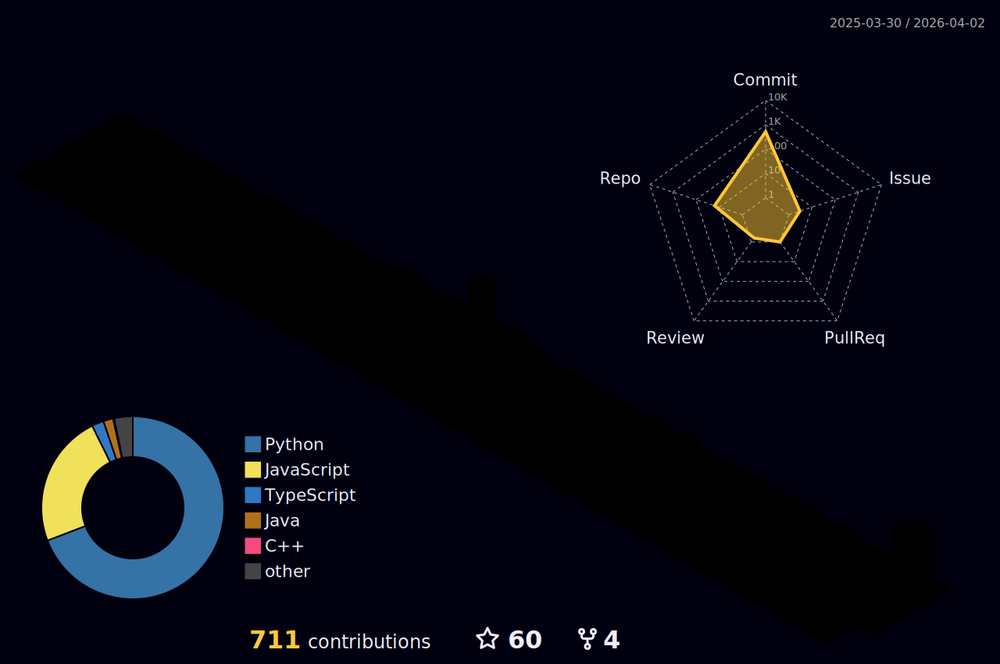

<div align="center">


<a href="https://git.io/typing-svg">
  
</a>

<br/>

<a href="https://jshsakura.github.io/">
  
</a>
&nbsp;
<a href="https://www.opencourse.kr">
  
</a>
&nbsp;
<a href="mailto:support@opencourse.kr">
  
</a>

</div>

---

```console
seunghyeon@github:~$ open jshsakura.github.io --interactive
```
> **Interactive Terminal Portfolio** — 19 Themes · Tab Autocomplete · Neofetch · Easter Eggs
> [`https://jshsakura.github.io`](https://jshsakura.github.io/)

---

```console
seunghyeon@github:~$ cat whoami.txt
```

```
훌륭한 목수는 보이지 않는 곳이라고 해서 썩은 나무를 덧대지 않는다.

11년차 프리랜스 개발자. 주로 Java/Spring 백엔드를 다루고,
React 프론트엔드, Python API, 모바일(Android/iOS)까지 풀스택으로 작업합니다.
요즘은 AI 도구들과 함께 생산성을 극대화하는 데 관심이 많습니다.
```

---

```console
seunghyeon@github:~$ ls skills/
```

```
Backend/     Java  Spring Boot  Node.js  Python  ASP.NET
Frontend/    React  Next.js  Tailwind CSS
DevOps/      Docker  Jenkins  Linux  Git  CI/CD
Database/    Oracle  MySQL  PostgreSQL
Mobile/      Android (Java)  iOS (Swift)
AI Tools/    Claude Code  Gemini CLI  Zai  Ollama
Devices/     Raspberry Pi
```

<div align="center">

<a href="https://skillicons.dev">
  
  <br/>
  
</a>

</div>

---

```console
seunghyeon@github:~$ neofetch --github
```

<div align="center">


&nbsp;


<br/>


</div>

---

```console
seunghyeon@github:~$ git log --graph --oneline
```

<div align="center">


</div>

---

```console
seunghyeon@github:~$ contrib --3d
```

<div align="center">

<picture>
  <source media="(prefers-color-scheme: dark)" srcset="./profile-3d-contrib/profile-night-rainbow.svg" />
  <source media="(prefers-color-scheme: light)" srcset="./profile-3d-contrib/profile-south-season-animate.svg" />
  
</picture>

</div>

---

```console
seunghyeon@github:~$ contrib --snake
```

<div align="center">

<picture>
  <source media="(prefers-color-scheme: dark)" srcset="https://github.com/jshsakura/jshsakura/blob/output/github-contribution-grid-snake-dark.svg" />
  <source media="(prefers-color-scheme: light)" srcset="https://github.com/jshsakura/jshsakura/blob/output/github-contribution-grid-snake.svg" />
  
</picture>

</div>

---

```console
seunghyeon@github:~$ stats --summary
```

<div align="center">


<br/>


</div>

---

<div align="center">


<br/><br/>


<a rel="me" href="https://pointless.chat/@opencourse" style="display:none"></a>

</div>
