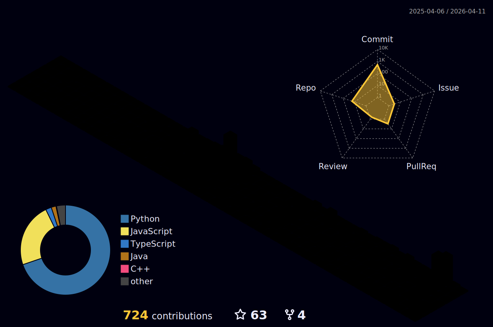

<div align="center">


<a href="https://git.io/typing-svg">
  
</a>

<br/>

<a href="https://jshsakura.github.io/">
  
</a>
&nbsp;
<a href="https://www.opencourse.kr">
  
</a>
&nbsp;
<a href="mailto:support@opencourse.kr">
  
</a>

</div>

<br/>

<table>
<tr>
<td width="50%" valign="top">

### `> cat whoami.txt`

```
훌륭한 목수는 보이지 않는 곳이라고 해서
썩은 나무를 덧대지 않는다.
```

프리랜서 풀스택 개발자. **언어에 구속되지 않고** 문제에 맞는 최적의 도구를 선택합니다.

백엔드, 프론트엔드, 모바일, 인프라까지 폭넓은 실전 경험을 바탕으로 **AI 코딩 도구를 적극 활용**해 생산성을 극대화합니다.

<br/>


</td>
<td width="50%" valign="top">

### `> open jshsakura.github.io`

<a href="https://jshsakura.github.io/">
  
</a>

<a href="https://jshsakura.github.io/">
  
</a>

</td>
</tr>
</table>

---

<div align="center">

### `> ls skills/ --icons`

</div>

<table>
<tr>
<td align="center" width="14%">

**Backend**


<br/>

<br/>


</td>
<td align="center" width="14%">

**Frontend**


<br/>


</td>
<td align="center" width="14%">

**DevOps**


<br/>


</td>
<td align="center" width="14%">

**Database**


<br/>


</td>
<td align="center" width="14%">

**Mobile**


<br/>

<br/>


</td>
<td align="center" width="14%">

**AI & Tools**


<br/>

<br/>


</td>
<td align="center" width="14%">

**Hardware**


<br/>


</td>
</tr>
</table>

---

<div align="center">

### `> showcase --featured`

</div>

<div align="center">

<a href="https://github.com/jshsakura/jshsakura.github.io">
  
</a>
<a href="https://github.com/jshsakura/open-tools">
  
</a>

</div>

---

<div align="center">

### `> git log --graph --oneline`


</div>

---

<div align="center">

### `> contrib --3d`

<picture>
  <source media="(prefers-color-scheme: dark)" srcset="./profile-3d-contrib/profile-night-rainbow.svg" />
  <source media="(prefers-color-scheme: light)" srcset="./profile-3d-contrib/profile-south-season-animate.svg" />
  
</picture>

</div>

---

<div align="center">

### `> contrib --snake`

<picture>
  <source media="(prefers-color-scheme: dark)" srcset="https://github.com/jshsakura/jshsakura/blob/output/github-contribution-grid-snake-dark.svg" />
  <source media="(prefers-color-scheme: light)" srcset="https://github.com/jshsakura/jshsakura/blob/output/github-contribution-grid-snake.svg" />
  
</picture>

</div>

---

<div align="center">

### `> stats --summary`


<br/>


</div>

---

<div align="center">


<br/><br/>


<br/><br/>


<a rel="me" href="https://pointless.chat/@opencourse" style="display:none"></a>

</div>
